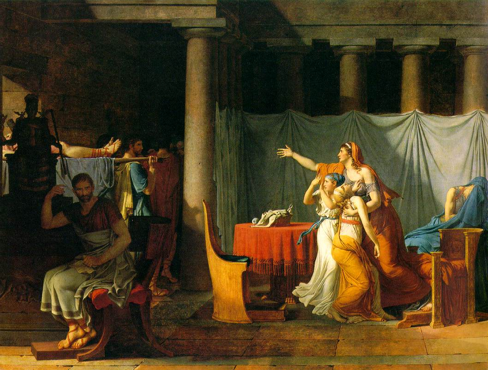

# Neo classicism
## Inspiration from Ancient Greece and Rome

- Neoclassical artists looked back to the art, architecture, and stories of ancient Greece and Rome
- They used classical themes, such as myths, heroic figures, and historical events, aiming for harmony, simplicity, and ideal beauty
- Their works often show balanced, symmetrical compositions and calm, ordered scenes, avoiding the drama and decoration of the earlier Baroque and Rococo styles
## Emphasis on Line, Clarity, and Moral Virtue

- Neoclassical art is known for its clear outlines, smooth surfaces, and restrained use of colour
- Artists valued drawing (line) more than painting (colour) and focused on precise, controlled technique
- Many paintings and sculptures have a serious, unemotional (sometimes called “austere”) look and often tell stories about duty, sacrifice, or the importance of moral values
## Historical Accuracy and Contemporary Relevance
- Artists aimed to show costumes, settings, and details as accurately as possible, based on archaeological discoveries and studies of classical art
- At the same time, they used ancient stories to comment on their own times, especially during political events like the French Revolution
- For example, Jacques-Louis David’s paintings celebrated republican values and heroism, linking ancient Rome to the struggles for liberty in France
# Contextual information
## Main location(s):
- Paris, France (especially for painting and sculpture)
- Rome and other parts of Italy (inspiration and study)
- London and other European capitals
## Relevant previous art movements:
- Rococo (Neoclassicism was a reaction against its lightness and decoration)
- Baroque (rejected its drama and excess)
## Relevant culture and politics:
- The Enlightenment (focus on reason, science, and progress)
- The American and French Revolutions (art used to promote civic virtue and moral ideals)
- Archaeological discoveries at Herculaneum and Pompeii inspired renewed interest in the ancient world
# Relevant writers and Composers:
## Writers: 
- Johann Joachim Winckelmann (art critic and theorist)
- Voltaire
- Jean-Jacques Rousseau
## Composers:
- Wolfgang Amadeus Mozart
- Joseph Haydn
- Ludwig van Beethoven (early works)
# Contemporary inventions and technology:
- Archaeological excavation tools
- Advances in printing and engraving (helped spread classical images and ideas)
- Improved travel (Grand Tour for young aristocrats)
## Typical fashions of the day for men and women:
- **Men:** Tailcoats, breeches, waistcoats, cravats, and powdered wigs
- **Women:**  High-waisted “empire” dresses, light fabrics, simple lines, and classical-inspired hairstyles
## Artists and Period
- **Period:** 1770–1850 (main years for Neoclassicism in art and sculpture)
Key Artists:
### Jacques-Louis David
- David was the leading figure of Neoclassical painting, renowned for his austere, morally charged history scenes that rejected Rococo frivolity in favour of classical severity and heightened emotion
- His works, such as "Oath of the Horatii" and "The Death of Marat," became symbols of revolutionary virtue and political propaganda, reflecting his active involvement in the French Revolution and later as Napoleon’s official painter
- David’s influence shaped French and European art for generations, both through his monumental canvases and his role as a teacher to many prominent artists, including Jean-Auguste-Dominique Ingres
### Jean-François Peyron
- Peyron was a French Neoclassical painter known for his clear compositions, restrained colour palette, and focus on historical and mythological subjects
- He competed with David and contributed to the revival of classical themes and moral seriousness in late 18th-century French art
- Peyron’s works emphasised rationality, virtue, and the didactic purpose of art, aligning with the ideals of the Enlightenment
### Gavin Hamilton
- Hamilton was a Scottish painter, archaeologist, and art dealer, instrumental in promoting Neoclassicism through both his paintings and his excavations in Rome
- His large-scale history paintings drew on classical antiquity for subject matter and compositional clarity, influencing artists across Europe
- Hamilton’s work and scholarship helped shape the taste for classical art in Britain and abroad during the late 18th century
### Antoine-Jean Gros
- Gros was a pupil of David who blended Neoclassical technique with the drama and colour of Romanticism, particularly in his dynamic battle scenes and portraits of Napoleon
- His works, such as "Napoleon Visiting the Plague Victims of Jaffa," are noted for their emotional intensity and vivid realism
- Gros’s approach paved the way for the Romantic movement in French painting
### Antonio Canova
- Canova was the preeminent Neoclassical sculptor, celebrated for his marble statues that revived the grace, harmony, and ideal beauty of classical antiquity
- His works, including "Psyche Revived by Cupid’s Kiss" and numerous portraits, are characterised by refined surfaces and serene compositions
- Canova’s influence extended throughout Europe, setting the standard for Neoclassical sculpture
### John Flaxman
- Flaxman was a British sculptor and draughtsman, renowned for his linear illustrations of Homer and Dante, as well as his elegant funerary monuments
- His art is marked by clarity, simplicity, and a deep engagement with classical sources
- Flaxman’s designs were influential in both the fine and decorative arts, contributing to the spread of Neoclassical taste in Britain
### Bertel Thorvaldsen
- Thorvaldsen was a Danish sculptor whose works, inspired by Greek and Roman models, epitomise the ideals of Neoclassicism
- He created monumental public sculptures and refined portrait busts, noted for their purity of form and calm grandeur
- Thorvaldsen’s international reputation rivalled that of Canova, and his legacy is celebrated in the Thorvaldsen Museum in Copenhagen
### Franz Xaver Messerschmidt
- Messerschmidt was an Austrian-German sculptor best known for his "Character Heads," a series of expressive busts that explore psychological and emotional states
- While trained in the Neoclassical tradition, his later works are noted for their originality and intense personal vision
- Messerschmidt’s sculptures are seen as precursors to both Expressionism and modern explorations of the human psyche
### Benjamin West
- West was an Anglo-American painter who became the second president of the Royal Academy in London and a leading figure in British Neoclassicism
- His history paintings, such as "The Death of General Wolfe," introduced contemporary dress and realism to classical subjects
- West’s teaching and advocacy helped shape the development of academic art in Britain and America
### Anton Raphael Mengs
- Mengs was a German painter and theorist, regarded as a founder of Neoclassicism for his advocacy of classical ideals and his frescoes and portraits
- His works are characterised by clarity, idealised forms, and a harmonious balance inspired by Raphael and ancient art
- Mengs’s influence was significant in both Italy and Germany, promoting a return to classical restraint and order
### Angelica Kauffmann
- Kauffmann was a Swiss-born painter who achieved international fame for her Neoclassical history paintings and portraits
- She was one of the founding members of the Royal Academy in London and known for her refined, elegant style and promotion of classical themes
- Kauffmann’s success helped pave the way for women artists in the academic tradition
### Jean-Auguste-Dominique Ingres
- Ingres was a leading French Neoclassical painter, celebrated for his precise draughtsmanship, idealised forms, and mastery of line in both portraiture and historical subjects
- His works, such as "La Grande Odalisque" and "The Apotheosis of Homer," combined classical clarity with sensuality and psychological depth
- Ingres’s art bridged Neoclassicism and Romanticism, profoundly influencing 19th-century painting in France and beyond
# Three Short Points for Students
- Neoclassical artists were inspired by ancient Greece and Rome, creating art that was balanced, clear, and focused on ideal beauty and moral lessons
- Their works used strong lines, simple shapes, and calm, serious subjects, often showing heroes or stories that encouraged virtue and self-control
- The movement was closely linked to the Enlightenment and major political changes, using art to promote reason, order, and civic values in society
# Glossary for Students:
- **Austere:** Plain and serious, not decorative or emotional
- **Symmetry:** When both sides of something are the same or balanced
- **Moral virtue:** Good qualities like honesty, bravery, and self-control
- **Grand Tour:** A long journey around Europe, especially Italy, taken by wealthy young people to learn about art and culture.
